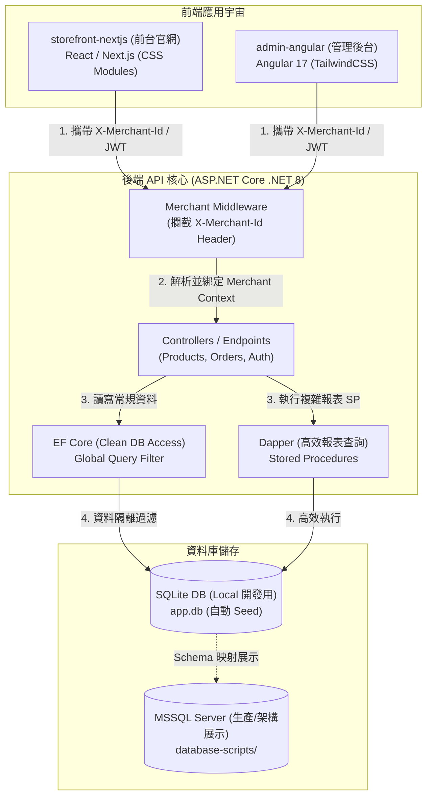

# E-Commerce Multi-Merchant CMS (多商家電商與內容管理系統)

這是一個展示多框架整合能力（React/Next.js、Angular）與 ASP.NET Core 後端的企業級全端架構 PoC (Proof of Concept) 展示專案。旨在呈現如何利用統一的後端 API 與資料隔離機制，為不同前端應用提供高效、安全的資料服務。

---

##  快速導覽 (Navigation)

<a href="#-線上展示入口-live-demo"> 線上展示入口 (Live Demo)</a><br>
<a href="#-專案核心亮點與過去解決方案重現"> 專案核心亮點與過去解決方案重現</a><br>
<a href="#-技術棧清單-tech-stack"> 技術棧清單 (Tech Stack)</a><br>
<a href="#-系統架構圖-system-architecture"> 系統架構圖 (System Architecture)</a><br>
<a href="#-專案目錄結構"> 專案目錄結構</a><br>
<a href="#-本地啟動與開發指南"> 本地啟動與開發指南</a><br>
&nbsp;&nbsp;&nbsp;&nbsp;<a href="#-推薦方式使用一鍵啟動控制台-windows-環境"> 推薦方式：使用一鍵啟動控制台 (Windows 環境)</a><br>
&nbsp;&nbsp;&nbsp;&nbsp;<a href="#-進階方式手動逐步啟動"> 進階方式：手動逐步啟動</a><br>
<a href="#-後台預置測試帳號與商店資訊"> 後台預置測試帳號與商店資訊</a>

---

##  線上展示入口 (Live Demo)

為了方便您快速體驗本系統的實際運行效果，我們已將應用部署至線上環境：

| 平台入口 | 部署平台 | 體驗連結 |
| :--- | :--- | :--- |
| **🛍️ 前台官網 (Storefront)** | Vercel | [點此前往體驗 ➔](https://estore-demo-red.vercel.app/) |
| **⚙️ 管理後台 (Admin Dashboard)** | Vercel | [點此前往體驗 ➔](https://nexashop-phi.vercel.app/) |

> [!TIP]
> 登入管理後台時，您可以使用本專案預置的測試帳號（詳見下方[後台預置測試帳號與商店資訊](#-後台預置測試帳號與商店資訊)）。

---

##  專案核心亮點與過去解決方案重現

本專案將實際開發中常見的痛點與解決方案進行封裝與呈現，主要亮點包括：

*   **多商家資料隔離與安全 (Multi-Merchant Isolation)**
    *   **重現場景**：在多商家 (SaaS) 電商系統中，最忌諱商家間的資料發生交叉污染或外洩。
    *   **解決方案**：在 `backend-dotnet` 中實作 `MerchantMiddleware` 攔截請求標頭 `X-Merchant-Id`。配合 EF Core 的 **Global Query Filter (全域查詢過濾器)**，在底層自動注入商家過濾條件（例如 `WHERE MerchantId = @MerchantId`），使開發人員在編寫一般 CRUD 時，不需手動串接商家 ID，徹底杜絕資料外洩風險。
*   **複雜報表效能優化 (Stored Procedures & Dapper)**
    *   **重現場景**：當商店規模擴大、訂單量達到百萬級時，多表 Join 查詢會導致首頁儀表板或銷售報表載入極度緩慢。
    *   **解決方案**：在 `database-scripts/stored-procedures/` 中，將複雜的月度銷售報表邏輯（包含當月銷量、上月銷量、環比成長率與熱銷 Top 3 商品）編寫為優化過的預存程序。利用 SQL 的 **CTE (Common Table Expression)** 與 **視窗函數 (Window Functions)** 進行一次性高效計算，避免在記憶體中進行多次循環過濾，大幅降低 I/O 負載。
*   **極致 SEO 與首屏優化 (Next.js & CSS Modules)**
    *   **重現場景**：電商官網前台對 SEO 與載入速度 (FCP) 要求極高，一般的 SPA 應用在沒有伺服器端渲染的情況下不利於搜尋引擎爬蟲。
    *   **解決方案**：在 `storefront-nextjs` 中，利用 Next.js 的 **SSR (Server-Side Rendering)** 與 **SSG (Static Site Generation)** 機制，在伺服器端預先抓取後端 API 資料並生成 HTML。樣式方案使用 **CSS Modules (Vanilla CSS)**，確保 CSS 只載入當前頁面所需的最小部分，並避免 Tailwind 在超大型網站中產生的龐大樣式表積累，提供極佳的 Lighthouse 評分。
*   **企業級後台嚴謹架構 (Angular & TailwindCSS)**
    *   **重現場景**：企業管理後台通常面臨高度複雜的表單校驗、大量數據表格 (Data Table)、分頁與動態排序，以及嚴格的權限控管 (RBAC)。
    *   **解決方案**：在 `admin-angular` 中，採用強型別的 TypeScript 與 Reactive Form，並深度使用 **RxJS 流式處理**，實作「防抖 (Debounce) 聯想搜尋與過濾」。配合 **Route Guards** 與動態選單，根據使用者角色權限 (RBAC) 自動進行路由攔截與按鈕級權限控制。排版採用 **TailwindCSS**，加速後台的快速開發。

---

##  技術棧清單 (Tech Stack)

| 目錄 / 元件 | 技術領域 | 使用技術 / 框架 | 版本 | 說明 |
| :--- | :--- | :--- | :--- | :--- |
| **`backend-dotnet`** | 後端 API | ASP.NET Core C# / EF Core / Dapper | .NET 8.0 | 採用 Clean Architecture，支援 JWT、多商家隔離 |
| **`storefront-nextjs`**| 前台官網 | React / Next.js (App Router) / CSS Modules | Next.js 14.x | 主打 SEO 與 FCP，展示 SSR/ISR 渲染技術 |
| **`admin-angular`** | 管理後台 | Angular / RxJS / TailwindCSS | Angular 17.x | 處理複雜資料表格、動態表單、銷售圖表與 RBAC 權限控管 |
| **`database-scripts`** | 資料庫 | SQLite (開發) / MSSQL (展示) | - | 包含完整 Schema 與高效預存程序腳本 |

---

##  系統架構圖 (System Architecture)



---

##  專案目錄結構

```text
fullstack-architecture-showcase/
├── README.md               # 整個宇宙的導覽手冊（本檔案）
├── .gitignore              # 綜合忽略規則
├── run-all.ps1             # Windows PowerShell 整合啟動與環境建置控制台
├── run-all.bat             # 雙擊直接執行 run-all.ps1 的 Windows 批次檔
│
├── 📂 database-scripts/    # 資料庫專區 (展示 MSSQL / Database 實力)
│   ├── schema.sql          # 資料表結構定義 (商家、商品、訂單、使用者、角色)
│   └── stored-procedures/  # 效能優化預存程序 (計算銷售額與環比)
│
├── 📂 backend-dotnet/      # 後端核心：ASP.NET Core Web API (Clean Architecture)
│   ├── src/
│   │   ├── Domain/         # 領域層 (Entities)
│   │   ├── Application/    # 商業邏輯 (Services, DTOs, Interfaces)
│   │   ├── Infrastructure/ # 資料庫存取 (DbContext, Seed Data, SQLite)
│   │   └── WebApi/         # 進入點 (Controllers, Middlewares, Program.cs)
│   └── README.md           # C# 架構設計、API 文件、DB 最佳化說明
│
└── 📂 frontend-clients/    # 前端宇宙：多框架與不同樣式方案展示
    ├── 📁 storefront-nextjs/  # Next.js App Router 前台 (CSS Modules)
    └── 📁 admin-angular/      # Angular 後台管理 (RxJS, TailwindCSS, Guard)
```

---

##  本地啟動與開發指南

本專案提供了根目錄一鍵啟動的控制台腳本，能夠自動檢測環境、還原套件並同步啟動前後端所有服務。

###  推薦方式：使用一鍵啟動控制台 (Windows 環境)

在專案根目錄下，您可以直接執行以下腳本：

1.  **雙擊執行**：雙擊根目錄的 `run-all.bat`。
2.  **PowerShell 執行**：
    ```powershell
    ./run-all.ps1
    ```

啟動後會出現功能選單，輸入 `1` 即可同時啟動後端 API、Next.js 前台與 Angular 後台，並自動於獨立的視窗中運行，免去手動開多個 Terminal 的繁瑣步驟。

---

###  進階方式：手動逐步啟動

如果您想要個別手動啟動服務，請參考以下步驟：

#### 1. 環境與依賴還原
在根目錄下，您可以透過控制台腳本輸入 `5` 自動安裝所有專案相依性，或者手動進入各目錄執行還原：
```bash
# 後端還原
dotnet restore backend-dotnet/src/WebApi

# 前台 Next.js 還原
cd frontend-clients/storefront-nextjs && npm install

# 後台 Angular 還原
cd frontend-clients/admin-angular && npm install
```

#### 2. 後端啟動 (ASP.NET Core Web API)
後端採用 SQLite，啟動時會**自動建立 `app.db` 並寫入測試 Seed Data**，不需手動安裝資料庫。
```bash
# 進入後端目錄
cd backend-dotnet/src/WebApi

# 啟動 API 伺服器
dotnet run
```
*   API 預設運行於：`http://localhost:5000` (或控制台輸出的 https 連接)
*   Swagger 文件：`http://localhost:5000/swagger`

#### 3. 前端啟動

##### 3.1 Next.js 前台 (`storefront-nextjs`)
```bash
cd frontend-clients/storefront-nextjs
npm run dev
```
*   運行於：`http://localhost:3000`

##### 3.2 Angular 後台 (`admin-angular`)
```bash
cd frontend-clients/admin-angular
npm start
```
*   運行於：`http://localhost:4200`

---

##  後台預置測試帳號與商店資訊

系統在啟動時會自動初始化 `app.db` (SQLite)，並寫入以下測試資料與帳號（預設密碼皆為 `password123`）：

| 帳號 Email | 所屬商店 (MerchantId / X-Merchant-Id) | 角色 (Role) | 功能說明 |
| :--- | :--- | :--- | :--- |
| **`store-a-admin@test.com`** | 極簡咖啡館 (`store-a`) | Admin | 咖啡館管理員，可管理咖啡館商品與查看月度銷量報表 |
| **`store-b-admin@test.com`** | 潮流服飾店 (`store-b`) | Admin | 服飾店管理員，可管理服飾店商品與查看月度銷量報表 |
| **`customer-a@test.com`** | 極簡咖啡館 (`store-a`) | Customer | 一般顧客，可於前台瀏覽商品與模擬下單 |

*   **前台官網測試**：可使用 `customer-a@test.com` 於 Next.js 前台進行商品瀏覽及下單。
*   **管理後台測試**：可使用 `store-a-admin@test.com` 或 `store-b-admin@test.com` 登入 Angular 後台，驗證多商家資料安全隔離、商品管理與月度銷售報表功能。
